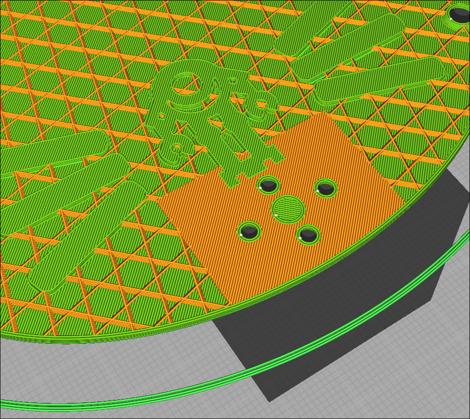

# Building
So, you want to build your own Cat Bot?  This section will detail the steps required to do that.  First, take a look at the [bill of materials](./bom.md), and make sure you have all the parts you'll need.

## 3D Printed Parts

The chassis, and some other parts, are designed to be 3D printed.  Details are in the BOM but here's a quick summary:
- the **main chassis** is what holds the two lids together, and absorbs most of the impact.  it's designed to be printed in TPU, ideally at 100% infill
- the **bottom lid** is what all of the internals of the bot are mounted onto.  Currently this should also be printed in TPU, but it's possible this will change in the future to something more rigid
- the **top lid** looks like the bottom lid but is flat on the inside.  it should also be printed in TPU, but again, this might change in the future
- the two motors are held on with **micro metal brackets**, usually printed in PLA or PETG
- while you can use any 42mm diameter wheels, Cat Bot includes some funky custom wheels.  these have three parts:
  - the main hub, printed in TPU at around 20% - 50% infill depending on how squishy you want it
  - the axle insert, printed in something rigid like PETG
  - the grippy tread (this isn't 3D printed but it is an important part of the wheel)

The colours of everything are up to you but generally I print the chassis in black, the top lid in pink, and the bottom lid in blue.  It's kinda hard to get pink and blue TPU, so generally I print them in white and dye them using **synthetic** clothes dye (eg: Rit) (non-synthetic dye doesn't seem to work that well).

> [!NOTE]
> When printing parts for the bot, pre-rendered renders of each part are provided in the [`renders`](../renders/) directory.  But if you're making changes to the OpenSCAD source, make sure to clone this repo's submodules (specifically [MCAD](https://github.com/openscad/MCAD), which this project depends on).  You can do this by running `git submodule update --init --recursive`.

> [!TIP]
> When printing the bottom lid, it's recommended that you print the area around the weapon mounting holes with 100% infill.
>
> When using Cura, you can create a support blocking cube, position and scale it around the mounting holes, then specify it to have 100% infill at overlapping areas in the Per-Model settings.
>
> 
> 
> 

# Wiring
todo :p

# Assembly
Now that you have everything printed and wires, you can start to assemble the bot!  Make sure you have a screwdriver and a way to insert brass inserts.

## Bottom Lid
The base of the bot is the bottom lid - this is the part onto which all the motors and electronics are mounted.  In between the wheel walls, there are two blocks each with four holes - these are for M3 brass inserts.  Both motors are held in place by a [micro metal bracket](../renders/micro_metal_bracket.stl), which screw into place using four pan-head M3 screws each.  

The weapon motor mounts onto the front of the bottom lid.  There are four countersunk holes for M2 screws to go through the lid into the motor.  There are an additional two holes around the motor - these are to secure the edge of the lid to the chassis, so we'll look at these later.  The wires of the motor can be kept out of the way by slotting them into the slot in the protective wall around the spinner area.  

Don't attach the weapon blade yet, since it's easier to install once the main chassis is installed.

## Wheels
At this point, mount the wheels into the bot using the micro metal mounts.  It's a good idea to attach the wheels to the motor axles before attaching them to the bottom lid, since it's quite difficult to remove the wheels once the motors are mounted.  If you are using the custom wheels, first insert the inserts into the big square hole in the hub, then cut enough grippy stuff to wrap around the wheels to make treads.  I usually attach the treads using thin double sided tape.

## Chassis and Weapon
Now, press the two M2.5 brass inserts into the holes around the switch hole in the main chassis.  I would also install the switch at this point because it can be tricky to do later.

In theory, you could run the whole bot with just the bottom lid, but then your electronics would be exposed.  As such, the bottom lid attaches to the main chassis via four M3 screws, into four M3 brass inserts in the chassis corners.  Make sure you get the chassis the right way up, since the spinner blade has to protrude from the hole in the front.  

When the bottom lid is printed from TPU, the forces produced by the spinner can cause the whole weapon assembly to "wobble".  This can lead to the weapon damaging the opening in the chassis, and possibly reducing the overall force of the weapon.  That's why there are two extra M2 holes around the motor!  These allow the edge of the bottom lid to be fastened onto two M2x3 inserts in the "nubs" protruding from the inside of the chassis. 

Speaking of the spinner, the blade can be attached to the spinner motor by sliding it in through the hole in the front of the bot, and fastening with four M2 screws.  These screws should ideally have a large / thick head to be able to handle the forces put on them by the weapon.

## Electronics and Finishing Touches
With all the motors attached to the lid, the electronics can be added.  To be honest, I mounted all of the driver boards and wiring using a lot of Blu Tack.  There are more elegant ways to do this but it works well!

Finally, the top lid can be attached to the main chassis in the same way the bottom lid was.

That's it!  Connect a battery, flip the switch, pair your controller, and have fun :3