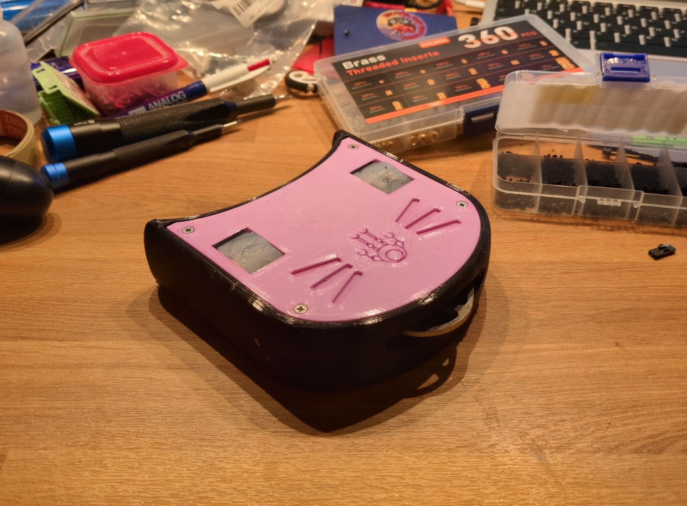

# Cat Bot / Scratch
This repo contains the design files for **Cat Bot**, aka **Scratch**.  This is a 450g / 1lb class battlebot I made that looks like a cat.  It was designed for the [Robotics Society](https://linktr.ee/qub_robotics) at Queen's University Belfast (QRS), for competition at my local battlebots group [Combat Robotics NI](https://www.combatroboticsni.com/).

# Features
- it looks like a cat :3
- (almost) the entire bot is printed from TPU to protect from impacts
- driven by two wheels (enclosed within the chassis for protection), which stick out the top and bottom to allow for operation when flipped
  - the QRS logo on the lids indicate the direction of "forward" for the motors, depending on which side is up
- multiple methods of offence
  - the cat's head is actually a plough which you can use to push opponents out of the arena
  - the cat's tongue is actually a spinner weapon so you can lick other opponents
  - you can decide which would be more useful based on your opponent
- internal walls to protect components from the wheels and the very fast spinner weapon
- designed using OpenSCAD, so *almost everything* is parametric and can be modified
- a [bill of materials](./docs/bom.md) and [build instructions](./docs/building.md) are provided to make replicating the bot easier
- external-facing screws are countersunk because it looks cool
- around 405 grams, and less than 140mm x 140mm x 40mm

# Building
A guide for building your own kitty friend are provided in [`docs/building.md`](./docs/building.md), along with the [bill of materials](./docs/bom.md)!

# Configurations
This bot was originally designed with two configurations: Little Cat and Big Cat.  As time went on, I only focused development on Little Cat so Big Cat kinda got left behind.  As such, it is deprecated and untested.  If you want to try Big Cat, check out git tag `v1.0.3`!

# Repo Structure
- [`exploded_view/`](./exploded_view/) - location to store images and render videos of an exploded view animation
- [`imports/`](./imports/) - external files imported by `cat_bot.scad` (eg: an SVG of the QRS logo)
- [`MCAD/`](./MCAD/) - submodule to [MCAD](https://github.com/openscad/MCAD), an OpenSCAD library dependency
- [`renders/`](./renders/) - exported STL versions of each part of each version of each configuration
- [`docs/`](./docs/) - documentation for the bot
  - [`building.md`](./docs/building.md) - cat bot build guide
  - [`bom.md`](./docs/bom.md) - bill of materials for each config
- [`src/`](./src/) - directory containing the OpenSCAD source code
  - [`cat_bot.scad`](./src/cat_bot.scad) - the main OpenSCAD source code file
  - [`cat_led_shim.scad`](./src/cat_led_shim.scad) - source code for the little shim that holds the power LED into the chassis
  - [`cat_wheel.scad`](./src/cat_wheel.scad) - source code for the custom wheels the bot uses
  - [`micro_metal_bracket.scad`](./src/micro_metal_bracket.scad) - a little bracket for the micro metal motors used by Little Cat
- [`readme.md`](./readme.md) - this readme!

# License
This is licensed under the MIT License - check out [`LICENSE`](./LICENSE) for more info.

# Acknowledgements
This has been one of the most interesting projects I've ever done.  I want to thank some of the people who helped me along the way!
- [Combat Robotics NI](https://www.combatroboticsni.com/) for providing a local space for destructive antweight battlebots, as well as the endless advice and assistance they've given me!
- [Team Penny](https://www.facebook.com/twopennymilk/) for their endless expertise and advice!